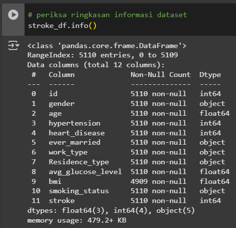
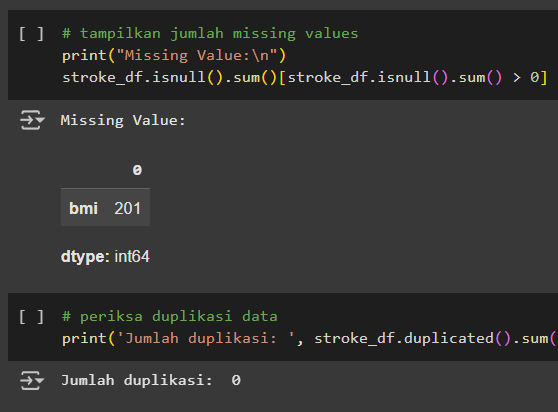
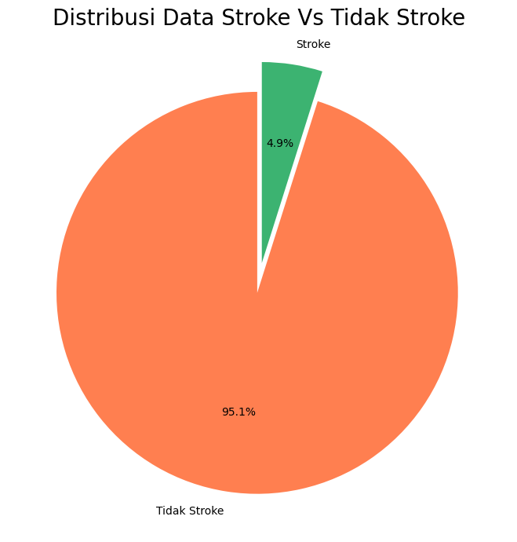
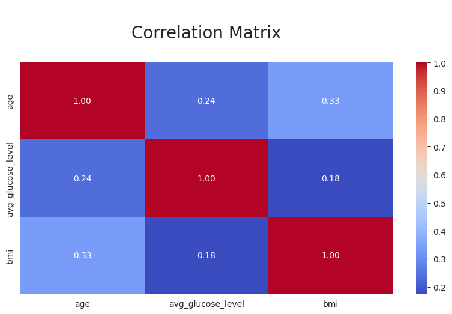
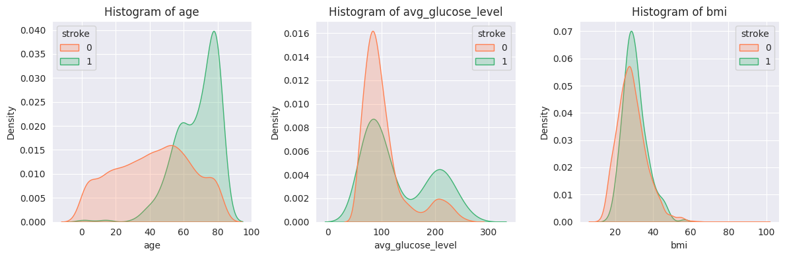
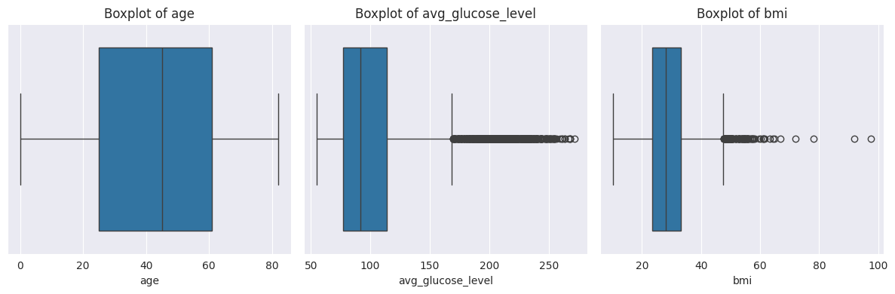
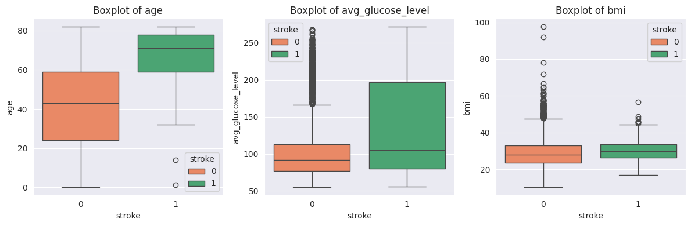
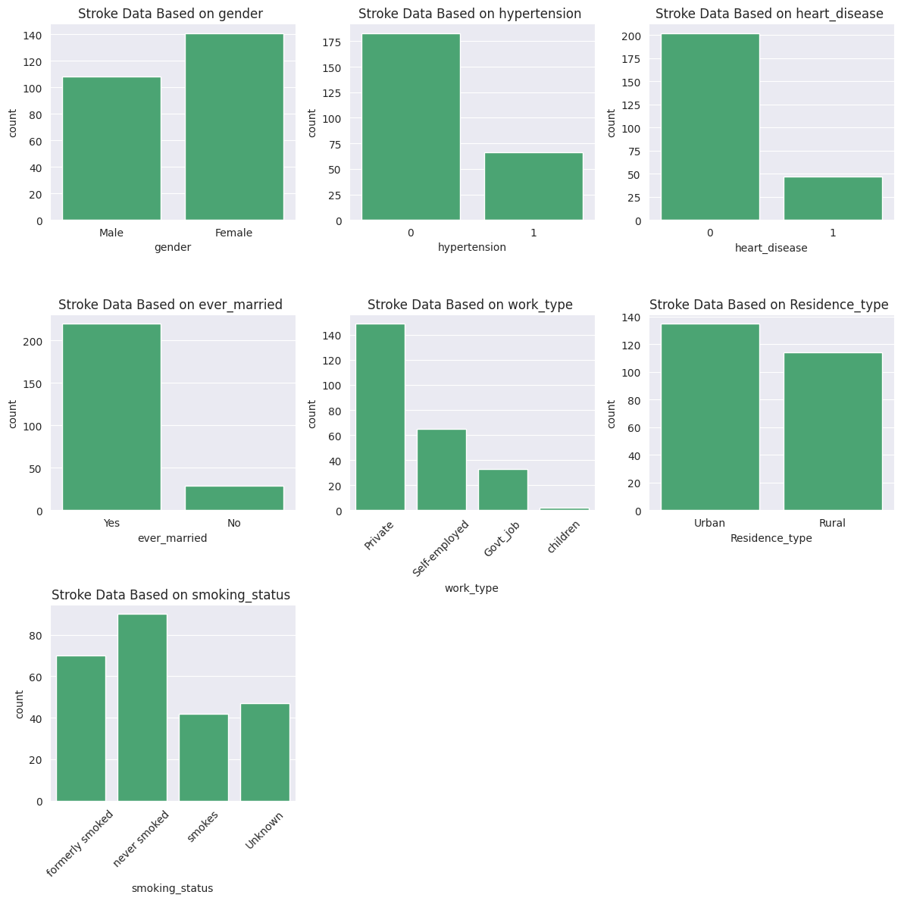
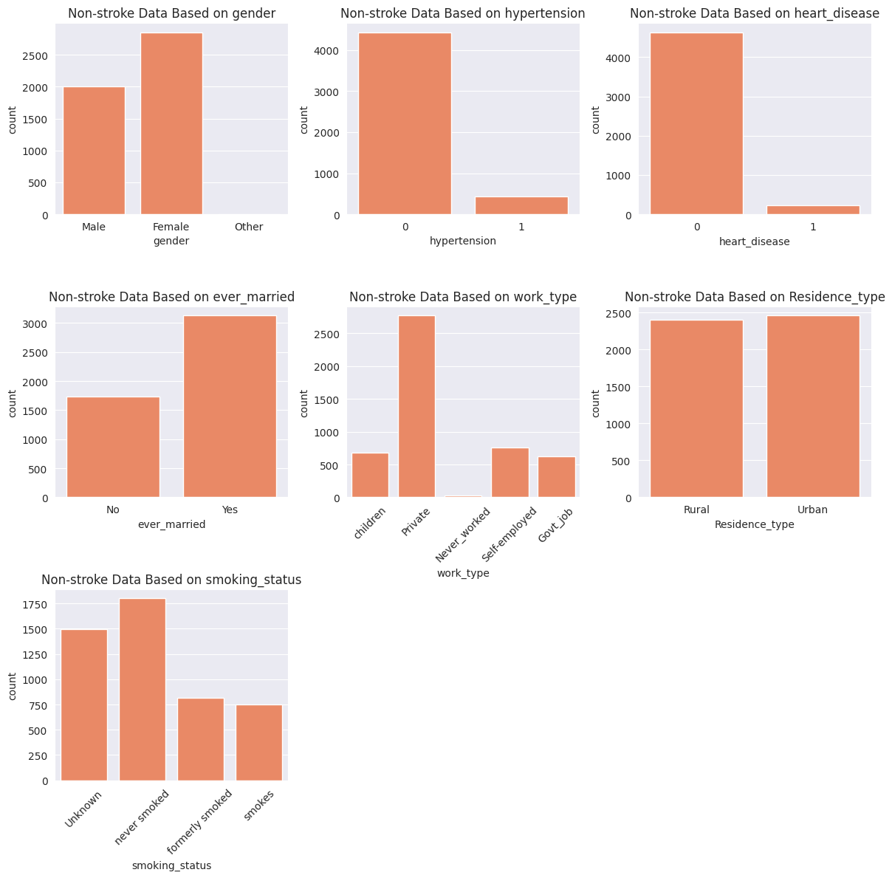

# Laporan Proyek Machine Learning - Dina Nabila

## Domain Proyek

Dalam upaya mendukung pengambilan keputusan di bidang medis, pemanfaatan data historis pasien untuk membangun sistem prediksi berbasis machine learning bisa menjadi langkah preventif yang relevan untuk diterapkan. Salah satu kasus yang membutuhkan pendekatan ini adalah penyakit stroke, yang dikenal sebagai salah satu penyebab utama kematian dan disabilitas di dunia. Melalu deteksi dini terhadap faktor risiko yang dimiliki pasien, peluang untuk melakukan pencegahan dan penanganan lebih awal dapat meningkat secara signifikan.

Menurut laporan World Health Organization (WHO), stroke merupakan penyebab kematian kedua secara global dan menjadi penyebab utama disabilitas jangka panjang. Pada tahun 2019, lebih dari 12 juta kasus baru stroke tercatat di seluruh dunia, dan sekitar 6.5 juta orang meninggal akibat kondisi ini (WHO, *World Stroke Organization Global Stroke Fact Sheet 2022*).

Masalah ini perlu segera diselesaikan, karena stroke sering kali terjadi secara mendadak dan tanpa peringatan yang jelas, sementara pengobatan dan tindakan medis darurat sangat bergantung pada waktu. Oleh karena itu, sistem yang dapat memprediksi risiko stroke lebih awal berdasarkan data pasien (seperti usia, tekanan darah, kadar gula darah, riwayat hipertensi, dsb) akan sangat bermanfaat untuk intervensi dini, terutama di fasilitas kesehatan primer dan daerah dengan sumber daya terbatas.

Implementasi sistem prediksi berbasis machine learning efektif karena mampu memproses sejumlah besar data serta menemukan pola-pola tersembunyi yang tidak selalu terlihat secara eksplisit oleh tenaga medis. Penelitian oleh Dritsas et al. (2022) yang dipublikasikan dalam *Sensors* menunjukkan bahwa penerapan beberapa algoritma machine learning mampu menghasilkan prediksi yang akurat dengan menggunakan metrik evaluasi seperti precision, recall, dan accuracy. Dari studi tersebut, metode stacking menunjukkan performa terbaik, dengan AUC sebesar 98.9% dan akurasi sebesar 98%, yang mencerminkan kemampuan model dalam membedakan pasien stroke dan non-stroke secara efektif.

Dengan demikian, pengembangan model prediksi yang berfokus pada peminimalan false negative sangat krusial. Dengan meminimalkan false negative (salah mengklasifikasikan pasien stroke sebagai tidak stroke), keterlambatan penanganan medis dan risiko komplikasi serius bahkan kematian dapat dihindari.

## Business Understanding
Berdasarkan latar belakang yang sudah dipaparkan sebelumnya, berikut adalah pernyataan masalah, tujuan, beserta solusi yang dirancang untuk mendukung pengembangan model prediksi risiko stroke yang efektif dan akurat.

### Problem Statements

Berikut pernyataan masalah yang perlu diselesaikan berdasarkan latar belakang yang telah dijelaskan sebelumnya:
- Stroke merupakan salah satu penyebab utama kematian dan disabilitas di seluruh dunia (sumber: WHO), sehingga deteksi dini terhadap faktor risiko dapat membantu pengambilan keputusan medis yang lebih cepat dan tepat untuk mencegah terjadinya stroke. Untuk itu, pernyataan masalah yang perlu dijawab adalah: **bagaimana cara mengantisipasi risiko stroke berdasarkan data pasien saat ini?**
- Dalam konteks medis, kesalahan model yang mengklasifikasikan pasien berisiko stroke sebagai tidak berisiko false negative dapat berakibat serius, termasuk keterlambatan penanganan atau bahkan kegagalan pencegahan yang dapat membahayakan nyawa pasien. Jika data historis pasien dapat dimanfaatkan untuk membuat sistem prediksi risiko secara otomatis, **seberapa besar kemungkinan terjadinya kesalahan prediksi (khususnya false negative)?** 

### Goals

Berikut tujuan yang harus dicapai guna menyelesaikan dua pernyataan masalah di atas:
- Melatih dan membandingkan beberapa algoritma machine learning untuk klasifikasi risiko stroke, sehingga keputusan medis yang lebih cepat dan tepat dapat segera diambil untuk mencegah terjadinya stroke.
- Mengukur tingkat false negative dalam model prediksi stroke agar dapat memahami potensi risiko penggunaan model dalam konteks medis.

### Solution Statements

Berikut solution statement (pernyataan solusi) yang perlu dilakukan untuk menjawab pernyataan masalah dan mencapai tujuan proyek. 
- Untuk goal pertama, solusi yang diterapkan adalah: 
    - Melatih beberapa model yang berbeda dengan algoritma Logistic Regression, Naive Bayes, Decision Tree, K-Nearest Neighbors, Random Forest, dan SVM.
    - Menganalisis perbandingan metrik evaluasi antar model untuk memahami model mana yang paling baik mendeteksi pasien stroke.
- Untuk goal kedua, solusi yang diterapkan adalah:
    - Menggunakan confusion matrix untuk mengevaluasi hasil klasifikasi, terutama untuk mengamati jumlah false negative.
    - Membandingkan metrik Recall antar model, karena Recall menunjukkan seberapa baik model mengenali kasus positif (stroke). Recall yang rendah → false negative tinggi.

## Data Understanding
Dataset [Kaggle Stroke Prediction Dataset](https://www.kaggle.com/datasets/fedesoriano/stroke-prediction-dataset) dengan jumlah data 5110 baris dan 12 kolom digunakan untuk melatih model klasifikasi stroke. Berikut variabel-variabel yang tersedia dalam dataset ini.

- id: unique identifier
- gender: jenis kelamin ("Male", "Female", "Other")
- age: usia pasien
- hypertension: ada atau tidaknya hipertensi (0: tidak hipertensi, 1: hipertensi)
- heart_disease: ada atau tidaknya riwayat penyakit jantung (0: tidak ada, 1: ada)
- ever_married: status apakah pasien sudah pernah menikah atau belum ("No", "Yes")
- work_type: pekerjaan ("children", "Govt_jov", "Never_worked", "Private", "Self-employed")
- Residence_type: tempat tinggal ("Rural", "Urban")
- avg_glucose_level: rata-rata kadar gula darah
- bmi: body mass index (indeks massa tubuh)
- smoking_status: pengalaman merokok ("formerly smoked", "never smoked", "smokes", "Unknown")
- stroke: 1: pasien stroke, 0: tidak stroke

**EXPLORATORY DATA ANALYSIS**

Berdasarkan informasi di atas: 
- Dataset memiliki **12 kolom** dengan **5110 baris data**
- Dataset memiliki 201 missing values pada kolom bmi
- Tidak terdapat duplikasi data pada dataset

Kemudian berdasarkan pie chart di atas, jumlah data pasien stroke dan tidak stroke sangat tidak seimbang. Perlu tindak lanjut oversampling.

Selanjutnya, berikut korelasi antar variabel berdasarkan Correlation Matrix di atas:
- age dan bmi = 0.33d
- age dan avg_glucose_level = 0.24
- avg_glucose_level dan bmi = 0.18

Lalu, periksa distribusi data fitur numerik dataset ini dengan menggunakan histogram. Berikut interpretasinya:

- **Mayoritas pasien stroke ada di rentang usia 60 s.d. 80**, sementara distribusi jumlah orang yang tidak mengidap stroke cenderung merata dari rentang usia 0 sampai 80 tahun.
- Jumlah pasien dengan **rata-rata gula darah 200 didominasi oleh pasien stroke** alih-alih pasien yang tidak stroke.
- Baik pasien stroke maupun non-stroke memiliki distribusi normal pada variabel bmi, dengan **densitas lebih tinggi pada pasien stroke**.

Berdasarkan kedua boxplot di atas, dapat dilihat bahwa avg_glucose_level pasien stroke lumayan lebih tinggi dibanding non-stroke.

Di saat yang bersamaan, karena data pasien stroke dan non-stroke tidak seimbang, maka outlier avg_glucose_level yang ada pada pasien non-stroke kemungkinan besar disebabkan oleh kedua hal tersebut.

Artinya, **outlier avg_glucose_level pada pasien non-stroke bisa jadi bukan merupakan noise**. Jadi jangan langsung dihapus outlier-nya.

Berikut penjelasan keadaan setiap fitur kategorikal dari dataset berdasarkan dua bar plot di atas:

- **gender**:
baik stroke maupun non-stroke, jumlah female nya sedikit lebih tinggi dari male

- **hypertension**: kalau yang stroke, juumlah yang ga hipertensi lebih banyak dari yang hipertensi, tapi perbandingannya lebih tinggi daripada non-stroke

- **heart_disease**: ini sama kayak hypertension case nya

- **ever_married**: kalau yang stroke mayoritas sudah menikah, di mana proporsinya lebih tinggi daripada non-stroke. kalau yang non-stroke, itu memang mayoritas sudah menikah juga, tapi jumlah pasien non-stroke yang belum menikah lumayan lebih besar proporsinya kalau dibandingkan sama yang pasien stroke yang belum menikah

- **work_type**: yang paling mencolok di sini yang children. pasien non-stroke lumayan banyak yang anak-anak, sementara kalau yang stroke sangat sedikit. Selain itu, ga ada pasien stroke yang belum pernah bekerja (Never_worked)

- **residence_type**: baik pasien stroke maupun non stroke sama-sama lebih banyak berdomisili urban. tapi kalau pasien stroke itu proporsi urbannya lebih tinggi perbandingannya dengan rural dibanding non-stroke. kalau non-stroke lebih rata.

- **smoking_status**: baik pasien stroke maupun non-stroke, mayoritas memang tidak pernah merokok. tapi ada pola yang berbeda di mayoritas kedua. pasien stroke yang pernah merokok (formerly smoked) ada di mayoritas kedua. ini pola yang berbeda dari orang non-stroke, di mana yang pernah merokok justru ada di urutan mayoritas ketiga.

## Data Preparation
Tahap data preparation dimulai dari cleaning data (drop kolom yang tidak diperlukan (id) dan menghapus missing value). Selanjutnya, data di-split menjadi data train dan test set. Lalu setelahnya pipeline berisi normalisasi data numerik menggunakan RobustScaler dan pelabelan data kategorikal dengan one hot encoding diterapkan untuk data train dan data test. Terakhir,  dataset train diseimbangkan dengan oversampling SMOTE (dataset test tidak ikut di-oversampling, sebab kita ingin data untuk test tetap pure asli tanpa adanya hasil data oversampling). 

Berikut rincian urutan tindakan preprocessing yang dilakukan:
1. Drop kolom yang tidak diperlukan (id). Alasannya, kolom id hanya berfungsi sebagai identifier unik untuk masing-masing baris data. Jadi harus dihapus supaya tidak ikut mempengaruhi proses pelatihan modelnya nanti
2. Hapus semua baris data yang memiliki missing value (hanya kolom bmi yang memiilki beberapa missing value, sisanya tidak). Pertimbangannya dihapus karena jumlahnya relatif kecil, sehingga tidak akan berpengaruh signifikan terhadap keseluruhan dataset. Dan alasan kenapa ga pilih imputasi, soalnya dikhawatirkan menimbulkan bias. Apalagi ini konteksnya untuk kepentingan medis. 
3. Data Splitting menggunakan fungsi train_test_split dari library scikit-learn, dengan rincian parameter sebagai berikut:
    - menggunakan nilai default pada test_size (test_size=0.25), sehingga tidak dicantumkan secara eksplisit. Alasan pemilihan default ini dikarenakan proporsi 75:25 merupakan salah satu standar umum yang digunakan dalam machine learning. Selain itu, proporsi ini juga memberikan jumlah data latih yang cukup besar unutk membangun model yang kuat, sekaligus tetap menyisakan cukup data uji untuk melakukan evaluasi terhadap performa model
    - menggunakan stratify=y agar proporsi distribusi kelas di train dan test set tetap terjaga, sehingga evaluasi model lebih adil dan representatif
    - menggunakan random_state=0 agar hasil split bisa direproduksi kapan pun dibutuhkan (karena konsisten)
4. Terapkan preprocessor yang isinya encoding dan normalisasi pada data train dan data test hasil split sebelumnya, dengan rincian sebagai berikut:
    - Melakukan normalisasi data dengan menggunakan robustscaler, sebab ada dua kolom numerik yang punya banyak banget outlier (avg_glucose_level dan bmi), terus juga ngga semuanya berdistribusi normal, ada yang bimodal juga (punya 2 puncak)
    - Melabeli data kategorikal dengan menggunakan one hot encoding. Ini penting karena sebagian besar algoritma machine learning tidak bisa memproses data dalam format string secara langsung, dan one hot encoding digunakan supaya tidak ada hubungan ordinal bias antar kategori
    - Melakukan oversampling dengan SMOTE, sebab dataset tidak seimbang, di mana data didominasi oleh data pasien tidak stroke daripada pasien stroke. Ketidakseimbangan ini kalau tidak ditangani dengan oversampling, bisa menyebabkan model bias terhadap kelas yang mayoritas. SMOTE dipilih untuk menangani oversampling dikarenakan bagus dalam membuat sampel sintesis, sehingga kelas menjadi lebih seimbang dan model bisa belajar mengenal pola dari kedua kelas secara adil
    - SMOTE hanya diterapkan pada data train

## Modeling
Pada tahap ini, beberapa model dilatih menggunakan algoritma Logistic Regression, Naive Bayes, Decision Tree, K-Nearest Neighbors, Random Forest, dan SVM. Parameter yang digunakan default, dengan random_state=0 untuk masing-masing algoritma (kecuali Naive Bayes dan K-Nearest Neighbors). 

**Logistic Regression**

Cara Kerja:
1. Ambil data input fitur-fitur X
2. Hitung kombinasi linearnya: z = w1x1 + w2x2 + ... + b
3. Masukkan z ke dalam fungsi sigmoid untuk menghasilkan nilai antara 0 dan 1 
4. Menerapkan ambang batas (threshold), biasanya 0.5. Jika output > 0.5, maka prediksi = 1 (positif). Jika output <= 0.5, maka prediksi = 0 (negatif)
5. Menggunakan optimisasi (seperti gradient descent) untuk memperbaiki bobot (w) berdasarkan fungsi log loss

Parameter Utama: 
- penalty: jenis regularisasi. Nilai default: "l2"
- C: kebalikan dari kekuatan regularisasi (semakin kecil, semakin kuat regulasi). Nilai default: 1.0
- solver: algoritma optimasi. Nilai default: "lbfgs"
- max_iter: iterasi maksimum saat training. Nilai default: 100
- class_weight: bagaimana bobot setiap kelas disesuaikan? Nilai default: None

Kelebihan: 
- Model relatif mudah untuk diinterpretasikan. Koefisien dalam logistic regression bisa menunjukkan arah dan kekuatan pengaruh fitur terhadap probabilitas output
- Efisien untuk data linear

Kekurangan:
- Tidak bisa menangani non-linearitas kompleks
- Ada asumsi multikolinearitas. Algoritma ini ngebuat model jadi mengasumsikan kalau fitur saling independen satu sama lain. Andai kata ada korelasi di antara fitur, hasilnya nanti bisa bias

**Decision Tree**

Cara Kerja:
1. Memilih fitur yang paling relevan untuk membagi data menjadi dua atau lebih subset. Pemilihan didasarkan pada nilai dari parameter criterion: "gini", "entropy", "log_loss", dengan default "gini". Pada model proyek ini, tree akan memilih fitur yang meminimalkan Gini Impurity setelah split. 
2. Membagi data berdasarkan nilai fitur yang terpilih. Setiap cabang dari node mewakili satu hasil pembagian data. Tahap ini diulang pada setiap subset hingga kondisi tertentu sudah terpenuhi.
3. Setelah kondisi tertentu tersebut terpenuhi, node terakhir yang disebut sebagai leaf node dijadikan sebagai hasil akhir dari prediksi. Untuk kasus klasifikasi, hasil tersebut berupa kelas yang paling sering muncul dalam data yang sampai pada node tersebut. 

Parameter Utama: 
- criterion: berfungsi sebagai parameter metode pengukuran ketidakmurnian node. Nilai default: "gini". Gini impurity mengukur seberapa sering sampel yang dipilih secara acak dari subset akan dikelompokkan dengan salah jika label dipilih secara acak. Kalau Gini=0, artinya node sepenuhnya murni (hanya memiliki satu kelas). Kalau Gini>0, node mengandung campuran beberapa kelas. 
- max_depth: kedalaman maksimum tree. Nilai default: None, artinya tree akan terus tumbuh sampai datanya habis. 
- min_samples_split: jumlah minimal data untuk bisa membagi node. Nilai default: 2.
- min_samples_leaf: jumlah minimal data di leaf. Nilai default: 1. 
- max_features: jumlah fitur yang dipertimbangkan untuk split. Nilai default: None. 

Kelebihan:
- Decision Tree bisa bekerja langsung dengan fitur kategorikal dan numerik tanpa normalisasi / encoding yang rumit
- Bisa menemukan kombinasi antar fitur yang kompleks tanpa harus diprogram secara eksplisit

Kekurangan:
- Berpotensi membuat pohon tumbuh terlalu dalam kalau belum di-prune, dan kalau udah gitu nanti bisa overfitting
- Kalau ada aja sedikit perubahan pada data, maka struktur pohon bisa ikut berubah secara signifikan (karena greedy algorithm pada pembentukan kode)

**Random Forest**

Cara Kerja:
1. Beberapa sampel diambil secara acak dari dataset pelatihan asli dengan teknik bootstrap, yaitu pengambilan sampel dengan penggantian sehingga beberapa data bisa muncul lebih dari sekali dalam satu sampel
2. Membangun decision tree untuk setiap sampel data yang diambil. Pada setiap node dalam tree, subset acak dari fitur dipilih untuk menemukan fitur terbaik saat membagi data pada node tersebut. Pemilihan fitur ini dilakukan untuk memastikan setiap tree dalam forest berbeda satu sama lain
3. Setiap decision tree dibangun hingga mencapai kriteria tertentu. Setiap tree belajar dari data dengan membuat keputusan berdasarkan fitur-fitur yang dipilih secara acak
4. Untuk kasus klasifikasi, setiap tree memberikan voting untuk kelas tertentu, dan yang paling banyak dipilih akan menjadi prediksi akhir. 

Parameter Utama:
- n_estimators: jumlah pohon dalam forest. Nilai default: 100
- criterion: jenis impurity. Nilai default: "gini"
- max_depth: kedalaman maksimum tree. Nilai default: None (tree boleh full tumbuh)
- min_samples_split: minimal data untuk split. Nilai default: 2
- min_samples_leaf: minimal data di leaf. Nilai default: 1
- max_features: fitur yang dipilih secara acak saat split. Nilai default: "sqrt" (akar dari jumlah fitur)
- bootstrap: untuk menentukan apakah sampling acak dilakukan dengan pengembalian? Nilai default: True

Kelebihan:
- Lebih robust terhadap overfitting kalau dibanding sama Decision Tree, soalnya Random Forest menggunakan banyak pohon dan nge-rata-ratain semua hasil dari pohonnya. Jadi varians dari modelnya berkurang
- Tahan outlier dan kelas ga seimbang, soalnya ada random sampling dan agregasi

Kekurangan:
- Kurang interpretatif
- Lebih berat secara komputasi, sebab ada banyak pohon yang harus dibangun dan disimpan, utamanya pas tuning hyperparameter

**KNN**

Cara Kerja:
1. Menghitung jarak antara data baru dengan setiap data lainnya dalam dataset latih. Tujuannya untuk menentukan seberapa mirip data tersebut dengan data yang sudah ada. Parameter yang menentukan metode pengukuran jarak: metric. Metode pengukuran jarak yang bisa digunakan: minkowski, manhattan, euclidean, dll.
2. Ambil sebanyak k data dengan jarak terdekat (k tertangga terdekat). Misalnya, dari 100 data latih, ambil 3 yang jaraknya paling dekat (k=3).
3. Hitung frekuensi label kelas dari setiap data tetangga. Label dengan jumlah terbanyak dianggap sebagai prediksi label untuk data baru yang bersangkutan. 

Parameter Utama: 
- n_neighbors: jumlah tetangga terdekat (k) yang akan dipertimbangkan ketika membuat prediksi. Nilai default 5, yang artinya algoritma akan mencari 5 tetangga terdekat dengan data baru, dan menggunakan mereka untuk menentukan prediksi kelas.
- weights: seberapa besar pengaruh setiap tetangga terdekat terhadap keputusan prediksi. Nilai default: uniform, yang membuat setiap tetangga memiliki pengaruh yang sama dalam menentukan hasil prediksi.
- algorithm: algoritma pencarian tetangga. Nilai default: auto, yang artinya akan menyesuaikan sendiri ketika dijalankan. 
- p: parameter jarak untuk metrik minkowski. Nilai default 2, yang artinya metrik jarak yang digunakan adalah Euclidean.
- metric: metode perhitungan jarak. Nilai default: minkowski. Minkowski merupakan generalisasi dari metrik euclidean dan manhattan yang bergantung pada parameter p.

Kelebihan:
- Tidak ada proses fitting yang rumit
- Tanpa asumsi distribusi data, sehingga cocok untuk data dengan pola kompleks, selama jarak antar titiknya relevan

Kekurangan:
- Sangat lambat saat prediksi, sebab model harus menghitung jarak ke semua data training, sehingga performanya bakal menurun kalau datasetnya besar
- Sensitif terhadap skala dan outlier, sebab kinerjanya sangat bergantung pada pemilihan metrik jarak dan preprocessing fitur (wajib normalisasi)

**SVM**

Cara Kerja:
Tahapan Cara Kerja: 
1. Memetakan data ke ruang fitur yang lebih tinggi menggunakan fungsi kernel untuk menangkap pola non-linier yang mungkin tidak terlihat dalam ruang fitur aasli. Kernel digunakan untuk mengubah data sehingga dapat dipisahkan secara linear dalam ruang fitur yang baru 
2. Pada ruang fitur yang lebih tinggi, hyperplane kemudian dicari untuk memisahkan data ke dalam kelas-kelas berbeda. Hyperplane dicari sampai nilai margin (jarak antara hyperplane dan titik data terdekat dari masing-masing kelas) maksimal
3. Mengidentifikasi support vectors, yaitu titik-titik data yang terletak paling dekat dengan hyperplane
4. Menangani data yang tidak terpisahkan secara linear di ruang fitur asli menggunakan hyperplane
5. Menyeimbangkan kompleksitas model dan akurasi dengan parameter regularization C
6. Klasifikasikan data baru berdasarkan posisi relatifnya terhadap hyperplane

Parameter Utama:
- C: parameter regularisasi untuk mengontrol margin. Nilai default: 1.0
- kernel: fungsi kernel yang digunakan untuk transformasi ruang fitur. Nilai default: "rbf" (radial basis function)
- shrinking: untuk mengaktifkan pengurangan solusi selama optimisasi. Nilai default: True
- probability: jika True, model akan memperkirakan probabilitas (butuh lebih banyak komputasi). Nilai default: False
- class_weight: menyesuaikan bobot kelas, berguna untuk kelas yang tidak seimbang. Nilai default: None
Kelebihan:
- Efektif untuk dataset yang punya jumlah fitur lebih banyak daripada jumlah sampel (kayak dataset teks untuk NLP)
- Mampu menangani data non-linear dengan menggunakan kernel tanpa perlu transformasi manual

Kekurangan:
- Lambat untuk dataset besar

**Naive Bayes**

Cara Kerja:
1. Menghitung probabilitas awal (prior probability) untuk setiap kelas
2. Mengitung probabilitas kemunculan fitur pada setiap kelas
3. Menghitung probabilitas setiap kelas berdasarkan fitur input dengan rumus Bayes
4. Memilih kelas dengan probabilitas tertinggi sebagai hasil prediksi

Parameter Utama:
- var_smoothing: berfungsi sebagai penambahan nilai kecil ke varians untuk stabilisasi perhitungan. Nilai default: 1e-9

Kelebihan:
- Ringan komputasinya

Kekurangan:
- Mengasumsikan semua fitur independen, padahal case yang seperti itu jarang terjadi di dunia nyata, sehingga bisa merugikan performa
- Tidak bisa menangkap interaksi kompleks antar fitur karena struktur probabilistiknya yang statis

**ALGORITMA YANG DIREKOMENDASIKAN UNTUK PROYEK INI:**

adalah **Logistic Regression**. 

Alasannya, algoritma ini mudah diinterpretasikan, sehingga dapat lebih mudah dimengerti oleh orang yang berkepentingan dengan hasil model ini, seperti dokter, perawat, maupun pasien itu sendiri. 

Selain itu, berdasarkan logistic regression juga direkomendasikan berdasarkan kesimpulan dari evaluasi model, yang dapat dibaca selengkapnya pada bagian penjelasan **Rekomendasi** di tahap Evaluation (setelah penjelasan evaluasi metrik masing-masing model).

## Evaluation
Untuk mengevaluasi masing-masing model klasifikasi di atas, metrik yang digunakan sebagai penentu utamanya adalah **recall**. Recall menunjukkan seberapa baik model mengenali kasus positif (stroke). Recall yang rendah → false negative tinggi. 

Adapun pada pada proyek ini juga digunakan metrik pelengkap lainnya sebagai tambahan interpretasi evaluasi, yakni **precision**, **f1-score**, dan **accuracy**. 

Berdasarkan metrik-metrik tersebut, berikut evaluasi model dari ter-aman sampai ter-rawan, dengan urutan dari ter-aman sampai ter-rawan sebagai berikut: 

1. Naive Bayes (nb)
recall-nya sempurna, jadi hampir dapat dipastikan tidak akan ada pasien stroke yang terlewat terdeteksi. Tapi akurasinya sangat rendah, yang artinya bakal banyak pasien yang dicurigai stroke padahal sebenarnya tidak stroke (false positive). Tapi memang dari segi keamanan (tidak ada false negative), sehingga naive bayes yang paling aman untuk kasus ini.
2. Logistic Regression (lr)
kalau ini recall-nya cukup tinggi (0.75), dan f1-score-nya juga paling tinggi dibanding model lainnya (0.19). Kalau precision, masih tergolong kecil, tapi kalau dari segi keseimbangan, ini lumayan oke kalau dibanding naive bayes.
3. SVM (svm)
ini recall-nya lumayan (0.51), dengan precision yang lebih tinggi daripada lr dan nb. Bisa dijadikan alternatif.
4. K-Nearest Neighbors (knn)
start dari urutan ke-4, recall-nya udah tergolong rendah. Untuk KNN sendiri, recall-nya masih lebih tinggi dari 2 model dengan recall terendah lainnya, tapi di sisi yang bersamaan, precision-nya rendah.
5. Decision Tree (dt)
yang ini accuracy-nya tinggi (0.89), tapi recall-nya rendah, yang artinya bakal banyak kasus stroke yang ga bakal terdeteksi, padahal pada kenyataannya adalah stroke (false negative nya tinggi). Ibaratnya, model ini ntar bakal sering nganggep seseorang itu sehat, padahal sebenarnya orang itu stroke. Kan bahaya.
6. Random Forest (rf)
ini model yang hasil metrik recall nya paling rendah dibanding semuanya. Paling berbahaya untuk digunakan dalam kasus klasifikasi stroke ini.

**Rekomendasi**: gunakan model dengan algoritma **Logistic Regression**.
Alasan:
    - recall tinggi, yang artinya jumlah false negative rendah
    - punya f1-score tertinggi di antara semua model, yang artinya model dengan algoritma logistic regression punya keseimbangan terbaik antara recall dan precision
    - simpel dan interpretable, yang artinya mudah dijelaskan ke dokter atau pihak non-teknis. Nanti si koefisiennya bisa diinterpretasikan sebagai "tingkat pengaruh" dari setiap fitur ke risiko stroke

Kenapa bukan Naive Bayes yang direkomendasikan?
Alasannya:
    - akurasi totalnya rendah
    - precision sangat rendah (5%), yang artinya dari 100 kasus yang diprediksi "positif stroke", cuma 5 yang benar-benar stroke. Ini bisa bikin sistem kehilangan kepercayaan pasien, dan bisa berpotensi overtreatment ke pasien. Jadi walau memang false negative itu lebih bahaya, tapi kalau terlalu banyak false positive jatuhnya bukan solusi yang ideal juga.

Sebelum masuk ke penjelasan formula metrik dan bagaimana metrik tersebut bekerja, ada beberapa istilah yang harus diperkenalkan terlebih dahulu. Bayangkan model sedang mengklasifikasikan apakah seseorang terkena stroke atau tidak. Hasil prediksi dari model tersebut bisa masuk ke salah satu dari 4 kategori berikut:
|                     | Prediksi: Stroke       | Prediksi: Tidak Stroke   |
|---------------------|------------------------|---------------------------|
| **Asli Stroke**     | TP (True Positive)     | FN (False Negative)       |
| **Asli Tidak Stroke** | FP (False Positive)    | TN (True Negative)        |

Berikut penjelasan masing-masing istilahnya:
- **TP**, artinya model memprediksi kalau seorang pasien itu stroke, dan pasien itu memang beneran stroke.
- **FN**, artinya model memprediksi kalau seorang pasien itu tidak stroke, padahal pada kenyataannya pasien ybs stroke. Ini yang bahaya.
- **FP**, artinya model memprediksi kalau seorang pasien itu stroke, padahal pada kenyataannya pasien ybs tidak stroke. Ini ngga seberbahaya FN, tapi tetap merugikan pasien.
- **TN**, artinya model memprediksi kalau seorang pasien itu tidak stroke, dan memang pasien itu beneran tidak stroke. 

Selanjutnya, kita masuk ke penjelasan formula dan cara kerja dari masing-masing metrik evaluasi klasifikasi:

**ACCURACY**

Rumus:
Accuracy = (TP + TN) / (TP + TN + FP + FN)

- Rumus ini mengukur proporsi total predikisi yang benar dari seluruh data
- numerator TP + TN menunjukkan semua prediksi yang benar (baik positif maupun negatif)
- denominator TP + TN + FP + FN menunjukkan total jumlah sampel

Artinya: 
- Accuracy menunjukkan seberapa sering model membuat prediksi dengan benar, baik itu memprediksi stroke, maupun tidak stroke
- Contoh casenya, kalau ada 100 pasien dan model berhasil menebak 90 dengan benar, maka accuracy-nya = 90%

**RECALL**

Rumus: 
Recall = TP / (TP + FN)

- Recall menghitung berapa banyak yang berhasil terdeteksi oleh model dari semua kasus yang sebenarnya positif?
- numerator TP menunjukkan jumlah pasien positif yang berhasil terdeteksi model
- denominator TP + FN menunjukkan semua pasien yang sebenarnya memiliki kondisi postif, terlepas dari apakah model berhasil mendeteksinya atau tidak

Artinya:
- Dari semua pasien yang memang stroke, recall menunjukkan seberapa banyak yang berhasil terdeteksi oleh model
- ALhasil, model yang punya recall tinggi bakal jarang meloloskan kasus stroke yang ga ketahuan. Jadi kalau recall-nya tinggi, maka kalau pasiennya memang punya indikasi stroke, kemungkinan besar bakal ketahuan. 

**PRECISION**

Rumus: 
Precision = TP / (TP + FP)

- Precision menghitung, seberapa banyak yang benar-benar positif dari semua prediksi positif?
- numerator TP menunjukkan jumlah pasien positif yang terdeteksi model
- denominator TP + FP menunjukkan total pasien yang diprediksi positif, terlepas itu beneran benar atau ternyata salah prediksi

Artinya: 
- Dari semua pasien yang diprediksi stroke oleh model, precision menunjukkan seberapa banyak yang benar-benar stroke
- Jadi, model yang punya precision tinggi ngga asal nebak kalau pasien anu stroke, padahal kenyataannya ngga. 

**F1-SCORE**

Rumus:
F1-Score = 2 x (Precision x Recall) / (Precision x Recall)

- F1-Score adalah gabungan antara Precision dan Recall, dan memberi nilai rata-rata harmonis
- Kalau precision dan recall nya tinggi semua, otomatis f1-score nya juga tinggi
- Metrik ini cocok digunakan jika hasil prediksi model harus seimbang, di mana kasus prediksi false positive tidak terlalu banyak, juga tidak banyak melewatkan hal yang penting

## REFERENSI
- [World Stroke Organization (2022). Global Stroke Fact Sheet 2022. https://www.world-stroke.org](https://www.world-stroke.org/assets/downloads/WSO_Global_Stroke_Fact_Sheet.pdf)
- [Dritsas, Elias, and Maria Trigka. "Stroke risk prediction with machine learning techniques." Sensors 22.13 (2022): 4670.](https://www.mdpi.com/1424-8220/22/13/4670/pdf)
